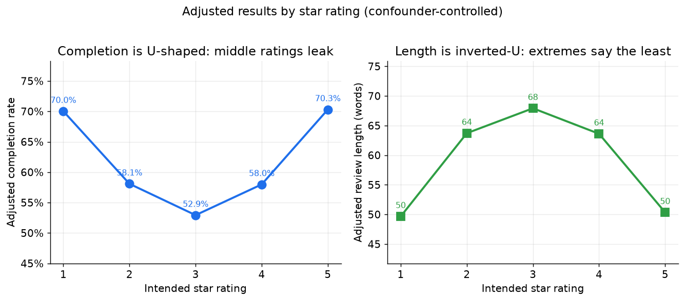
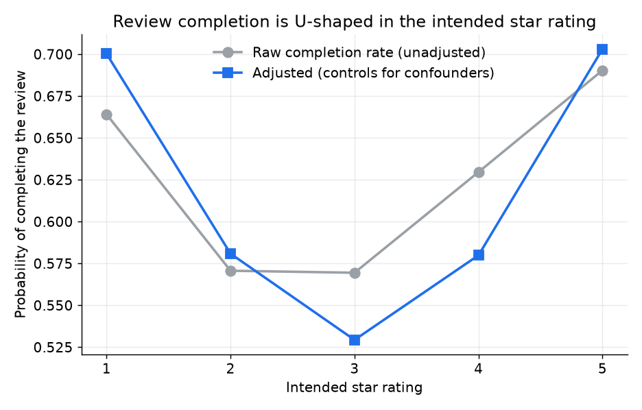
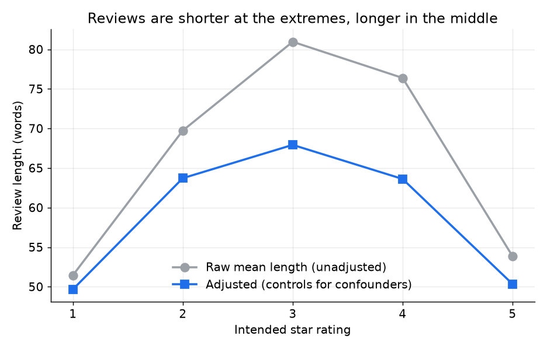
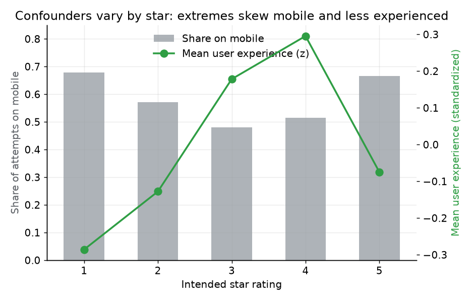
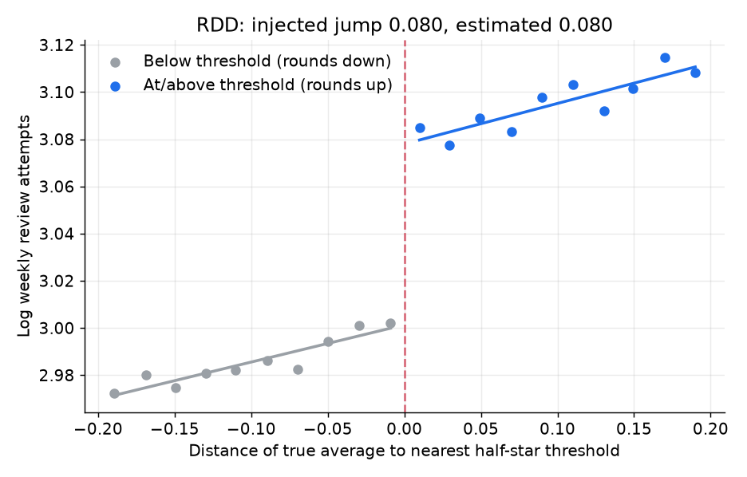

# Star rating and the review-creation funnel

> **This is built on synthetic data.**

**Live demo:** https://k1monfared.github.io/star_rating_regression_analysis/ , the interactive explorer of review completion and length by star rating.

Product needs to know where the review-creation funnel leaks and where the reviews we do get are too thin, so we can target completion help and detail prompts at the right raters. This project models completion and review length as a function of the intended star rating, using logistic and negative binomial regression with confounder adjustment and g-computation to separate the rating from the user and the device that produced it. The payoff is a defensible read on which levers actually move completion, worth up to +16.8 pp per lever, so roadmap investment goes to real leaks rather than an artifact of who rates on mobile.

## Outputs



*Adjusted, confounder-controlled results by star rating: completion sags in the middle (U-shape) while length peaks in the middle and thins at the extremes (inverted-U).*

### 1. Where do people give up when writing a review, and where are reviews too thin?

They give up in the middle of the star scale, and the reviews that do land are
thinnest at the extremes. Adjusted completion is 70.0% at 1 star and 70.3% at 5
star, but sags to 58.1% at 2 star, 52.9% at 3 star, and 58.0% at 4 star. Length
runs the opposite way: adjusted mean length is 49.7 words at 1 star and 50.3
words at 5 star, against 63.7, 67.9, and 63.6 words at 2, 3, and 4 star. The
ratings that finish most easily are the ones that say the least.

How: g-computation over the adjusted logistic completion model and the negative
binomial length model, fixing the star for every row and averaging over the
observed covariates. The reading is a completion U-shape and an inverted-U in
length.

So what: aim completion help (save draft, a progress cue, a "help me say it"
assist) at 2 to 4 star writers where the funnel leaks, and aim detail prompts
(aspect cues such as quality, value, and reliability) at 1 and 5 star reviews where they
run short.

### 2. What actually moves completion?

The review invitation moves it most at +16.8 pp, the mobile composer is the
biggest drag at −13.7 pp, and writer experience is worth +9.0 pp per standard
deviation (elite status adds +5.6 pp). The raw star pattern is misleading until
these confounders are controlled: the naive completion U-shape coefficient reads
0.112, while the adjusted model recovers 0.204 against an injected truth of
0.200.

How: average marginal effects on completion probability from the adjusted
logistic regression, and the naive-versus-adjusted comparison of the (star−3)^2
coefficient. The reading is that prompts and desktop beat anything tied to the
rating itself, and adjustment nearly doubles the estimated U-shape.

So what: invest in review invitations and the mobile composer, and never read
raw completion across ratings without adjusting for device and experience, or
the roadmap points at the wrong leak.

These answers come from the completion and length regressions, the confounder
adjustment that separates the rating from the person and the device, and the
marginal-effect levers read off the adjusted model. The rest of this document is
the technical write up: how the data was built, the models, the exact numbers,
and the caveats.

## Contents

- [How to run](#how-to-run)
- [The problem](#the-problem)
- [How the data is created and the goal](#how-the-data-is-created-and-the-goal)
- [Method](#method)
- [Results](#results)
- [Business implications](#business-implications)
- [Data-science validation and observational caveats](#data-science-validation-and-observational-caveats)
- [Limitations](#limitations)
- [What production would add](#what-production-would-add)

## How to run

Interactive demo: `sh demo.sh` (serves the page on a free local port and opens your browser).

Reproduces the data, the analysis, the outputs, and the figures from a fixed seed.
All dependencies are free and open source.

```bash
python -m venv .venv
source .venv/bin/activate
pip install -r requirements.txt

python scripts/run_demo.py
```

`scripts/run_demo.py` is the single entry point. It writes:

- `data/review_attempts.csv`, `data/businesses.csv` (committed)
- `outputs/*.json` and `outputs/summary.md` (committed)
- `docs/images/*.png` (committed)

Helper scripts: `scripts/generate_data.py` writes only the data, and
`scripts/generate_figures.py` re-renders only the figures. An optional static
explorer is at [`docs/index.html`](docs/index.html).

## The problem

On a review platform, users open the composer intending to leave a rating, but
many never submit. Product wants to know two things to improve the funnel:

1. Where does completion drop, as a function of the rating a user is about to give?
2. Where are reviews thin, so we know where to encourage more detail?

The observed field pattern that motivated this analysis: extreme ratings (1 and
5) complete more often and tend to be shorter, while middle ratings (2, 3, 4)
complete less often and run longer. The catch is that this raw pattern is
confounded. The kind of user and session that produces an extreme rating differs
systematically from the kind that produces a middling one. This project quantifies
the relationship while controlling for those differences, and is explicit that
the result is an association, not a causal effect.

## How the data is created and the goal

The data is generated from a documented ground-truth model so we can check that
the analysis recovers what we put in. Full details are in
[`data/DATA_DICTIONARY.md`](data/DATA_DICTIONARY.md) and the exact parameters live
in [`configs/data_config.json`](configs/data_config.json).

- 60,000 review attempts across 4,000 businesses, one row per attempt.
- Each attempt has an intended star rating (1 to 5), user features (experience,
  tenure, elite status), business features (category, popularity, average rating),
  session context (mobile vs desktop, whether an ML prompt opened the composer),
  whether the review was completed, and its length if completed.
- Two relationships are injected as ground truth:
  - Completion is U-shaped in the star rating: a positive coefficient on
    `(star - 3)^2`, so completion is highest at 1 and 5.
  - Length is inverted-U: a negative coefficient on `(star - 3)^2`, so reviews are
    shorter at the extremes and longer in the middle.
- Confounding is deliberately real. The intended star is correlated with device
  (mobile skews to extreme ratings), experience (experienced users skew to
  moderate ratings), and business average. Those same variables independently
  drive completion and length. So the raw star pattern is biased, and only a
  model that controls for the confounders recovers the injected truth.

The goal is to recover the injected U-shape and length pattern, show that
controlling for confounders changes the naive estimates, and translate the result
into funnel actions.

## Method

Regression, two outcomes.

- Completion: logistic regression. Star enters two ways, as a categorical factor
  `C(intended_star)` and, in a second specification, as a single quadratic term
  `(star - 3)^2` that captures the U-shape with one interpretable coefficient.
  Controls: experience, device, prompt, elite, business popularity, category.
- Length (completed reviews only): OLS on log word count for interpretability,
  plus a negative binomial GLM with a log link that matches the count
  data-generating process.
- For each outcome we fit a naive model (star only) and an adjusted model (star
  plus controls) to show how confounding changes the estimates.
- Predicted curves by star are produced by g-computation: fix the star for every
  row, predict, and average over the observed covariate distribution.
- Optional extension: a half-star rounding regression discontinuity (see below).

## Results

All numbers are from the actual run (`python scripts/run_demo.py`, seed 42) and
are reproduced in [`outputs/summary.md`](outputs/summary.md) and the JSON files in
[`outputs/`](outputs).

### Completion is U-shaped in the intended star rating



| Star | Raw completion | Adjusted completion |
| --- | --- | --- |
| 1 | 66.4% | 70.0% |
| 2 | 57.1% | 58.1% |
| 3 | 56.9% | 52.9% |
| 4 | 63.0% | 58.0% |
| 5 | 69.0% | 70.3% |

The injected U-shape coefficient on `(star - 3)^2` was **0.200**. The adjusted
model recovers **0.204** (95% CI 0.192 to 0.216). The naive model, with no
controls, recovers only **0.112** (95% CI 0.101 to 0.123). Controlling for
confounders nearly doubles the estimated U-shape and moves it onto the truth.

### Reviews are shorter at the extremes, longer in the middle



| Star | Raw mean words | Adjusted mean words |
| --- | --- | --- |
| 1 | 51.5 | 49.7 |
| 2 | 69.7 | 63.7 |
| 3 | 81.0 | 67.9 |
| 4 | 76.4 | 63.6 |
| 5 | 53.9 | 50.3 |

The injected length coefficient on `(star - 3)^2` (log scale) was **-0.075**. The
negative binomial GLM recovers **-0.077** (95% CI -0.080 to -0.074). The negative
sign confirms the extremes are shorter. Here the naive OLS-on-log estimate is
**-0.109** versus the adjusted **-0.077**: the raw data overstates how much
shorter the extremes are, because mobile sessions (short, and over-represented at
the extremes) masquerade as a rating effect until you control for device.

### Why the raw pattern is biased



Extreme ratings come disproportionately from mobile sessions and less experienced
users. Mobile lowers completion, and less experienced users complete less, so the
extremes are dragged down in the raw data, which hides part of the U-shape. For
length, mobile shortens reviews, so the extremes look shorter than the rating
alone implies. Controlling for these puts both patterns where the truth is.

### Marginal effects of the controls (completion)

Average marginal effects on completion probability from the adjusted model:

| Lever | Effect on completion |
| --- | --- |
| Session was prompted (ML nudge) | +16.8 pp |
| On mobile (vs desktop) | -13.7 pp |
| User experience (+1 SD) | +9.0 pp |
| Elite user | +5.6 pp |

These are the strongest movable levers in the funnel and are all highly
significant (p far below 0.001 except category terms).

### Optional RDD: half-star rounding



A lightweight regression discontinuity on the classic idea that a business page
displays its average rounded to the nearest half star. We inject a small known
jump (0.080 in log weekly review attempts) at the rounding thresholds and recover
**0.080** (95% CI 0.071 to 0.088) with a local-linear RDD in a 0.20 bandwidth.
This is a secondary demonstration of the design. The primary conclusions rest on
completion and length.

## Business implications

- Completion is weakest in the middle of the rating scale. The 2 to 4 range sits
  roughly 12 to 16 percentage points below the extremes on completion (adjusted).
  That is where the funnel leaks, and where a save-draft, progress, or "help me
  say it" assist targeted at middling raters would recover the most reviews.
- Detail is thinnest at the extremes. One-star and five-star reviews are the
  shortest even after adjustment. If the goal is richer, more useful reviews, the
  nudge for more detail (for example aspect prompts like quality, value, and reliability)
  should fire on extreme ratings, where reviews are short, not on middling ones
  that already run long.
- Prompts and device are the biggest funnel levers. An ML prompt is worth about
  +17 pp of completion and mobile costs about -14 pp. Investing in the mobile
  composer experience and in well-targeted prompts moves completion more than
  anything tied to the rating itself.
- These map directly to review-contribution goals: more completed reviews from the
  middle of the scale, and more detailed reviews from the extremes.

## Data-science validation and observational caveats

- Recovery check: the adjusted models recover the injected coefficients within
  tight confidence intervals (completion U-shape 0.204 vs 0.200, length U-shape
  -0.077 vs -0.075, RDD jump 0.080 vs 0.080). See
  [`outputs/naive_vs_adjusted.json`](outputs/naive_vs_adjusted.json).
- Confounding is real: the naive completion U-shape (0.112) is far from the truth
  and only the adjusted estimate (0.204) recovers it, so the controls are doing
  genuine work rather than decoration.
- Fit and significance: adjusted logit pseudo-R2 rises to 0.09 from 0.006 naive,
  and adjusted length OLS R2 rises to 0.29 from 0.09. All key coefficients are
  reported with 95% confidence intervals in the output JSON.
- This is observational. The star rating is not randomly assigned, so every number
  here is an association after adjusting for observed confounders. Unobserved
  confounders (mood, review topic, prior interactions) could still bias it.
- A causal estimate would need randomization, for example randomizing whether the
  detail nudge fires, or a credible natural experiment. The RDD extension is the
  one place we exploit a quasi-random boundary, and even there the estimand is the
  local effect of the displayed rounding, not of the rating itself.

## Limitations

- Magnitudes are illustrative, chosen to be realistic rather than measured from a
  real platform.
- The confounder set is the one we injected. Real data has more, and some are
  unobserved.
- Length is modeled for completed reviews only. Selection into completion is
  handled by controlling for the same observed covariates that drive completion
  (selection on observables). With unobserved drivers of both, a selection model
  such as Heckman would be needed.
- The RDD is a compact illustration, not a full RDD study (no bandwidth
  optimization, no manipulation or density tests).

## What production would add

- Real event data from the composer with a defined attempt and completion schema.
- A causal layer. Every headline here is an association after adjustment, so the
  next step is a design that identifies the effect rather than only controlling for
  observed confounders. Concretely, in rough order of how clean the identification is:
  - **Randomized encouragement, the cleanest instrument.** Fire the detail nudge or
    the save-draft assist for a random subset of raters. The random assignment is a
    valid instrument for actually engaging with the assist, and two-stage least
    squares recovers the local effect on completion and length among the users it
    moves, without the self-selection that biases an observational read, since
    motivated raters adopt the assist on their own.
  - **Fuzzy RDD at the rounding boundary.** Use crossing a half-star threshold as an
    instrument for the displayed star, controlling for the true running average, to
    estimate the causal effect of the displayed rating. This is the proper version
    of the compact RDD shown here, with data-driven bandwidth selection, a density
    (manipulation) test at the cutoff, and covariate-continuity checks.
  - **Difference-in-differences around a platform change.** A composer redesign, a
    prompt rollout, or a change to the rounding rule that reaches some cohorts or
    regions before others is a natural experiment. Compare completion and length
    trends for exposed against not-yet-exposed groups.
  - **An observational instrument, used with care.** The recent leave-one-out
    displayed average from other reviewers can nudge a focal reviewer's rating
    through anchoring while being plausibly unrelated to that reviewer's own
    experience, which makes it a candidate instrument for the rating. The exclusion
    restriction is the fragile part and would have to be argued and stress-tested,
    so this is a fallback when no experiment or discontinuity is available.
  - **Sensitivity analysis for the observational estimates.** Report an E-value or
    Rosenbaum bounds so a reader knows how strong an unobserved confounder would
    have to be to overturn each reported association.
- Robust standard errors clustered by user and business, and out-of-time
  validation.
- Selection modeling for length, and a richer confounder set (draft history,
  session depth, prior contribution).
- Monitoring of the funnel curve over time and by segment, wired to the
  experimentation platform.
